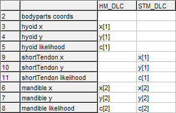

Glossary
--------
 - "DLC" = [DeepLabCut](https://github.com/DeepLabCut/DeepLabCut)
 - "AAA" = [Articulate Assistant Advanced](http://www.articulateinstruments.com/downloads/) (software by Articulate Instruments Ltd.)
 - "Model" = A neural net's trained memory for a specific task, ie. a standalone bundle of files and folders representing training, which can then be used to automatically plot points on new data.
 - ".yaml" = A file format that stores configuration data in an easy-to-read format. DeepLabCut uses such a file to store the metadata for a trained model.


-------------------------
What this document covers
-------------------------
 - [Where's the config.yaml file(s)?](#wheres-the-configyaml-files)
 - [What do I need to know if I'm **NOT** running Windows?](#what-do-i-need-to-know-if-im-not-running-windows)
 - [How do I use an existing model to plot points on new videos?](#how-do-i-use-an-existing-model-to-plot-points-on-new-videos)
 - [How do I create/train a model?](#how-do-i-createtrain-a-model)
 - [How do I modify an existing model to train it on additional data?](#how-do-i-modify-an-existing-model-to-train-it-on-additional-data)
 - [How do I import DLC output into AAA?](#how-do-i-import-dlc-output-into-aaa)
 - [How do I rename a model, its authors or its data?](#how-do-i-rename-a-model-its-authors-or-its-data)

For instructions on installing DeepLabCut:
 - See the [Installation_Instructions folder](Installation_Instructions) in this directory for details on how to run DLC.


--------------------------------
Where's the config.yaml file(s)?
--------------------------------
DeepLabCut stores metadata about a model in a file called config.yaml. You can't load a model into DLC without its config.yaml.

Because this is a git repository anybody can get, you could clone/download it anywhere on your computer. These configuration files must contain absolute file-paths, which means the file-paths could be different for everybody who downloads this repository. To overcome this, the installation scripts provided in the folder [Installation_Instructions](Installation_Instructions) will automatically generate any appropriate configuration files for the models in this repository such that they contain the correct paths inside them for your computer.

Every time you run the script [Run_DeepLabCut.bat](Installation_Instructions/Run_DeepLabCut.bat) it will check if the configuration files area already installed, and if not it will install them. You can force an installation of the configuration files (overwriting any already present) by double-clicking on the script [Install_Config_Files.bat](Installation_Instructions/Install_Config_Files.bat).

If you are not using Windows or for any reason it does not work correctly, instructions to do it manually are as follows:
- Inside the folder [`.\Installation_Instructions\Other_Files`](Installation_Instructions/Other_Files) are files called [`auto[SOMETHING]`](Installation_Instructions/Other_Files/autoConfigUltrasound). Make a copy of each of these file(s) in the root folders of their corresponding models: for example, make a copy of `autoConfigUltrasound` inside `.\Ultrasound`, a copy of `autoPoseCfgLipsMobileNetTest` inside `.\Lips\dlc-models\iteration-0\Tal_LipsJan28-trainset35shuffle1\test`, etc. The corresponding folders are:
    - Lips Shuffle 0 = ResNet 50
    - Lips Shuffle 1 = MobileNet 2_1.0
    - Ultrasound Shuffle 0 = ResNet 50
    - Ultrasound Shuffle 1 = MobileNet 2_1.0

    Next, rename the copies in the project roots to `config.yaml` and the copies in the model directories to `pose_cfg.yaml`.

- Open them all in a text editor and replace the file-paths, eg. `REPLACE_PATH\videos\TaL_1to8003.avi` with appropriate qualified file-paths. For example, in the `config.yaml` copied from `autoConfigUltrasound.txt`, you would replace the string `REPLACE_PATH` with a qualified absolute path to the Ultrasound folder, eg. `C:\DeepLabCut-for-Speech-Production\Ultrasound` _(no trailing backslash!)_.


----------------------------------------------------
What do I need to know if I'm _NOT_ running Windows?
----------------------------------------------------
The repository includes a number of installation scripts in the form of Windows batch files: they are only designed to run on Windows 7 and later.
This document will **NOT** provide detailed instructions on installing DeepLabCut for Linux or MacOS. Please consult these documents for help installing DLC:
 - https://github.com/DeepLabCut/DeepLabCut/blob/master/docs/installation.md
 - https://deeplabcut.github.io/DeepLabCut/docs/recipes/installTips.html

If you are still stuck after following the guidance at those webpages, look inside the installation Windows batch scripts inside the folder [`.\Installation_Instructions`](Installation_Instructions) in this repository. They contain comments explaining the process to install DLC on Windows, some of which may be helpful to you.

The trained DLC model(s) provided in this repository are fully usable except for the config.yaml file(s) which do not exist yet. See the above section "[Where's the config.yaml file(s)](#wheres-the-configyaml-files)?". Because you cannot run the Windows batch script that generates the files, you will need to do so manually using the instructions in the above section.


------------------------------------------------------------
How do I use an existing model to plot points on new videos?
------------------------------------------------------------
This repository contains 4 pre-trained models:
| Target        | Model        | Mean Accuracy MSD           | Training & Analysis Speed    | [`config.yaml`](#wheres-the-configyaml-files) to load        | Shuffle | 
|:-------------:|:------------:|:---------------------------:|:----------------------------:|:------------------------------------------------------------:|:-------:|
| Ultrasound    | ResNet50     | 0.**93** mm _(sd 0.**46**)_ | Slowest                      |`.\Ultrasound\config.yaml`                                    | `0`     |
| Ultrasound    | MobileNet v2 | **1.06** mm _(sd 0.**59**)_ | **2.13**x faster             |`.\Ultrasound\config.yaml`                                    | `1`     |
| Lips          | ResNet50     | 0.**71** mm _(sd 0.**54**)_ | Slowest                      |`.\Lips\config.yaml`                                          | `0`     |
| Lips          | MobileNet v2 | 0.**73** mm _(sd 0.**52**)_ | **2.13**x faster             |`.\Lips\config.yaml`                                          | `1`     |

---------------------
First, run DeepLabCut.

`Manage Project` -> `Load existing project` -> `Select the config file` (Browse for a .yaml file) -> `OK` -> `OK`

To load this project's pre-trained models, you can find their `config.yaml` files in the folders called [`Lips`](Lips) and [`Ultrasound`](Ultrasound). If they are not there, you need to go to the folder [`Installation_Instructions`](Installation_Instructions) and double-click the file called [`Install_Config_Files.bat`](Installation_Instructions/Install_Config_Files.bat).

When you have loaded a config.yaml file you should see many tabs appear along the top of the DLC user interface.

Select the tab `Analyze videos`.

Click `Select videos to analyze` and select one or more videos in any of the following video file formats: .avi, .mp4, .mov. You can select multiple videos at once (eg. by
holding the shift-key and clicking multiple videos). Please now select the shuffle index corresponding to the model you wish to use, with reference to the [above table](#how-do-i-use-an-existing-model-to-plot-points-on-new-videos). 

If you are using any of the pre-trained models for speech production in this Git repository, you should ensure that all videos you analyze are in a resolution of approximately 320x240 pixels for best results. If you are exporting from [AAA](http://www.articulateinstruments.com/downloads/), exporting a lower resolution will **NOT** degrade your data quality when re-importing splines from DLC. If you want to rescale existing videos, a script is included called [`Convert_Video_to_320x240.bat`](Installation_Instructions/Convert_Video_to_320x240.bat) which you can drag-and-drop video files onto (including multiple at once) to convert them to 240px height and maintain the aspect ratio, thus making them a good size for optimal use with this model. DeepLabCut must be installed first for this to work.

DLC has several options visible at this stage which you should consider. For the purposes of simply plotting a tongue contour for each video frame, leave the options at their defaults. If you plan to import the output of the DLC analysis into AAA software, please set `Want to save result(s) as CSV?` to `Yes`.

When you are ready to begin analysis (which could take many minutes or hours), click `Step 1: Analyze Videos`. The more data you are analysing (ie. more videos, longer videos and/or higher values of "frames-per-second" in your videos) the longer DLC will take to process them. As a general rule, if you have a CUDA compatible GPU and have set it up correctly for DeepLabCut to use, then it will run approximately 5-10 times faster than if you're using the CPU. A Nvidia RTX2060 GPU can process approximately 4500 video frames per minute at 320x240 resolution, whereas an Intel i7-11370H CPU can process approximately 440 video frames per minute at 320x240 resolution.

Once you have clicked `Step 1: Analyze videos`, a command prompt called "IPython: ..." will be in your Windows taskbar. You can click on this to view the progress of the DLC video analysis.

As it finishes processing each video, the data for that video (including .csv data if you specified CSV output) will appear in the same folder as the video(s) being analyzed.

When DLC has finished analyzing all videos, return to the DLC user interface (eg. click DeepLabCut in your Windows taskbar) and select the tab at the top called `Create Videos`.

Click `Select videos` and choose the exact same video(s) you chose during the analysis step. DLC will look in the same folder(s) and see the data files it generated during the analysis. If, in your output videos, you wish to see the data points connected by straight-lines (eg. plotting a tongue contour, to see the points joined into a single contour) then set `Include skeleton in the video?` to `Yes`. As before, ensure that you select the correct video type corresponding to your input videos.

If you wish for points the model evaluates as not visible (eg. occluded by an object or in an ultrasound shadow) to not be plotted on the output video, set `Plot all bodyparts?` to `No`.

When you are ready to generate the videos, click `RUN`. Depending on the version of DeepLabCut, it may create many duplicate DeepLabCut windows: you can close any one of these windows to proceed. This process is 5 to 50 times faster than the analysis of videos in the previous stage.

As it finishes generating each video, the new output video will appear in the same folder as its corresponding input video, with a suffix on its name corresponding to the model used to analyze it.


------------------------------
How do I create/train a model?
------------------------------
Run DeepLabCut.

Click on the tab `Manage Project` at the top.

Name your new project and write one or more names for the authors responsible for this model. The project name and authors can be changed later but it is tedious to do and requires some technical skill, so it is advised to finalise all name(s) here. (See the [section on renaming](#how-do-i-rename-a-model-its-authors-or-its-data) in this document for how to rename a model, its authors or its data).

**IMPORTANT**: If you wish to train a DLC model for tracking objects or structures (such as a tongue) of which no multiples of any object(s) will ever be visible at the same time (eg. no more than 1 tongue, 1 hyoid and 1 mandible visible in the image at a time), then ensure that the checkbox labeled `Is it a multi-animal project?` is NOT checked. You can still track multiple objects/structures in the image (eg. 1 tongue contour, 1 hyoid), but this is specifying there will never be multiples of a any type of object/structure.

You can choose a directory for the model and all its files and subfolders to be created in with the checkbox `Select the directory where project will be created`, otherwise a folder will be created for your new model inside the same folder you ran DeepLabCut from (your working directory from which you launched DLC, which may be in your Anaconda folder or your Python folder).

Click `Load Videos` and choose one or more videos (in the formats .avi, .mp4 and/or .mov) from which to extract frames for analysis (you can multi-select videos, eg. by holding the shift-key and clicking multiple videos). When you have chosen all the videos you wish to form the basis of your model's training, click `Ok`.

You should now see many tabs appear along the top of the DLC user interface.

Select the tab `Extract Frames`.

DLC only extracts fixed number of frames from each video. This number can be changed in the `config.yaml` file which has been generated for your new model: in that file it's a setting called `numframes2pick`. You can edit the `config.yaml` file using a text editor or by going to the `Manage Project` tab in DLC and clicking `Edit config file`.
By default, a portion of the frames which will be extracted from the videos (and which you will label) will NOT be used for training, but will be held back as test data to evaluate the performance of the trained network later. The default value is 0.95 which means that 95% of the data will be used for training and the remaining 5% for testing, but you can change this value in the `config.yaml` file at the heading:

TrainingFraction:
- 0.95

At this stage it is important to set up the points on your target object(s)/structure(s) to track, such as a tongue tip or the hyoid; in DLC these are referred to as `body parts`. These body parts must be defined inside the `config.yaml` file so you must edit that file to define them. There is a heading inside the `config.yaml` file which looks like:

```
bodyparts:
- bodypart1
- bodypart2
- bodypart3
- objectA
```

You can edit these labels and add/remove them to create a list appropriate for your project, such as:

```
bodyparts:
- vallecula
- tongueRoot
- tongueBody
- tongueDorsum
- tongueBlade
- tongueTip
- hyoid
- mandible
- shortTendon
```

If you wish for these points to be visually connected by straight lines, such as lines joining the points of a tongue contour, look for the heading in the `config.yaml` that looks like:

```
skeleton:
- - bodypart1
  - bodypart2
- - objectA
  - bodypart3
  ```

This can be edited as before, and the format is such that each label with two preceeding dashes, eg. `- - bodypart1` has a line joining it to the line after, which in the above example would be `  - bodypart2`. These lines do not have a direction so the order does not matter.

By default, DLC will use automatic frame extraction using the [kmeans algorithm](https://en.wikipedia.org/wiki/K-means_clustering). This is adequate for most purposes, but there are options available to extract frames in a different way if you wish. Click `Ok` to extract frames with the selected options.

The next tab, `Label frames`, you can click the button `Label frames` to open a new window where you can load frames for labelling. Use the button `Load Frames` in the bottom-left to select the individual folders corresponding to your videos. Once you have loaded a folder, right-click to assign points and left-click-and-drag points around to reposition them. If you find the points too large or small to see visually you can adjust how they are displayed with the `Adjust marker size` slider (this is purely for visual clarity at this stage and does not affect training or analysis). You can zoom-in by clicking `Zoom` and then left-click-dragging a box over the region of the image to focus. To zoom-out click `Home`. Remember to click `Save` when you are finished labelling each batch of frames, then load the next folder to label, if you have more than one. Press the button `Quit` when you are finished.

When you are finished, go to the tab `Create training dataset` and choose the settings you wish. It is recommended to use the latest version of network "mobilenet_v2" (eg. `mobilenet_v2_1.0`) and use `imgaug` augmentation. When you are ready to proceed (which will require an internet connection), press `Ok`. This doesn't take very long, and does not constitute training the model yet.

Next, go to the tab `Train network`. Here you can choose how many iterations should be used in training with `Maximum iterations`. A higher number of iterations may produce a better result but will take longer (time scaling linearly). The `Display iterations` sets how often progress is displayed to the Python console during training, eg. 1000 means every 1000th iteration; if you set this value too low it can significantly slow down training due to the time needed to write to the console. The setting `Save iterations` specifies how often to write its progress to disk and clear its memory, eg. a value of 1000 means save to disk every 1000th iteration.
If you are unsure what values to use, try setting `Display iterations` to 500, `Save iterations` to 10000, `Maximum iterations` to 1000000, and `Number of snapshots to keep` to 10; these settings on a midrange PC (circa 2020) with a CUDA GPU this will probably require 6-12 hours so you may wish to run it overnight. If you wish to test that training works without crashing, you can do a quick test by setting `Display iterations` to 5, `Save iterations` to 50 and `Maximum iterations` to 100; this will do a very short meaningless training in under a minute, the results of which will be automatically overwritten the next time you train properly.
When you are ready to begin the long process of training which will take several hours, click `Ok`.

A command prompt called "IPython: ..." will be in your Windows taskbar. You can click on this to view the progress of the DLC training.

If your training has completed successfully, congratulations! You can now return to the DLC user interface (eg. click DeepLabCut in your Windows taskbar) and select the tab at the top called `Evaluate Network`. If you already have evaluated this model in the past, you MUST delete the folder `evaluation-results` in your model folder to allow new evaluation to occur. After choosing settings (the default settings are adequate for most purposes) click `Step 1: Evaluate Network`. When this is finished, there will be a folder in your model folder called `evaluation-results` which contains images showing hand labeled points plotted as "+" symbols and automatically generated points plotted as round dots. There is also a .csv file containing evaluated metrics.


-----------------------------------------------------------------
How do I modify an existing model to train it on additional data?
-----------------------------------------------------------------
Before you proceed with this section, note that if you perform the following instructions it will irrecoverably modify the model(s) in this project which you are adding data to. You may wish to make a backup of the files in the `.\Lips` and/or `.\Ultrasound` folders now.

There are two ways to add additional data to an existing model:
1. Add one or more new videos to the project, label them, and add them to the dataset.
2. Extract outlier frames from existing videos in the project, label them, and merge them back into the dataset.

### **Method 1 (adding new videos)**:
If you have videos ready to add, you can keep them anywhere on your computer and still add them to the dataset without any extra work; if you want to you can put them in the same folder as the existing videos in the project, which can be found at the folders [.\Lips\videos](Lips/videos) and [.\Ultrasound\videos](Ultrasound/videos).

First load your DeepLabCut project, and in the `Manage Project` tab in DLC click `Load New Videos` and select the new videos you wish to add. You can multi-select videos and also repeat the process by clicking `Load New Videos` more times to stage further videos to add. When you have selected all the videos you want to add, click `Add New Videos`.

Now click `Edit config file`. In this config.yaml you should see a list of file-paths to the videos in the project, under the heading `video_sets:`. Disable _(comment-out)_ all the video paths which are **NOT** your new videos by prefixing them with a `#` symbol, for example changing

    C:\DeepLabCut-for-Speech-Production\REPO\Lips\videos\002_cal.avi

to

    # C:\DeepLabCut-for-Speech-Production\REPO\Lips\videos\002_cal.avi

Similarly, disable the lines `crop: 0, 320, 0, 240` by prefixing them with a `#`. Then save the file, and return to DeepLabCut.

Go to the tab `Extract frames` at the top and choose the settings you would like to use, then click `Ok`. You can click on the window called "IPython..." in your Windows task bar to watch the extraction progress. When it is finished, return to DeepLabCut and select the `Label frames` tab at the top. Click the button `Label Frames` on the right, then click the button `Load Frames` in the bottom-left to select the individual folders corresponding to your videos. Once you have loaded a folder, right-click to assign points and left-click-and-drag points around to reposition them. If you find the points too large or small to see visually you can adjust how they are displayed with the `Adjust marker size` slider (this is purely for visual clarity at this stage and does not affect training or analysis). You can zoom-in by clicking `Zoom` and then left-click-dragging a box over the region of the image to focus. To zoom-out click `Home`. Remember to click `Save` when you are finished labelling each batch of frames, then load the next folder to label, if you have more than one. Press the button `Quit` when you are finished.

Now, return to editing the config.yaml file which you modified earlier: if you closed it you can open it again by clicking the `Manage project` tab at the top and then clicking `Edit config file`. For all of the lines you disabled by prefixing them with a `#`, re-enable them now by removing the `#` from the start of each line, and then save the file.

Return to DeepLabCut and click on the tab `Create training dataset`. Select any settings that you wish to use and click `OK`. When that is complete, you are now ready to re-train the model on the new dataset you have created. This can take several hours, so you may wish to run it overnight. Until you re-train your model in this way, it will **NOT** include your new training data in its evaluation. When you are ready, go to the `Train Network` tab and select the settings you want. If you are unsure what settings to choose, use the defaults. When you are ready to begin the long training process, click `Ok`. When it is complete, your new model is ready to use.

### **Method 2 (extracting, editing and merging outliers)**:
First, load into DLC the existing model you wish to modify.
Go to the tab `Analyze videos` and load in (by clicking `Select videos to analyze`) only the videos which you wish to modify. Select the settings you desire and click `Step 1: Analyze Videos`.

When that process is done, go to the DLC tab `Extract outlier frames` and load the SAME new videos as you chose in the previous step. Select the type of outlier extraction algorithm you desire. Information on how each algorithm works is available by clicking the button `Help`.

When you are ready, click `Ok`. A command prompt called "IPython: ..." will be in your Windows taskbar. Click on this to monitor the extraction and provide input when asked. If you want, you can repeat this process of choosing an algorithm and running it multiple times to try each extraction algorithm.

When you have extracted all the frames you wish, look in the folder in your model called `labeled-data`. There will be new folders here corresponding to the new videos you added.

Now, go to the DLC tab `Refine labels` and click `LAUNCH`. This will open a window identical to the one used for labelling new data. Load the folders corresponding to the extracted frames of your new videos. You can now step through each outlier frame and move points by left-clicking and dragging them around. You can also delete points that you wish to train as being occluded or out of the frame by right-clicking them, but be careful because deleting them in this way cannot be undone. Once you have edited all these outlier frames to your satisfaction, click `Save` and then `Quit`.
Now, click `Merge dataset`.

Return to DeepLabCut and click on the tab `Create training dataset`. Select any settings that you wish to use and click `OK`. When that is complete, you are now ready to re-train the model on the new dataset you have created. This can take several hours, so you may wish to run it overnight. Until you re-train your model in this way, it will **NOT** include your new training data in its evaluation. When you are ready, go to the `Train Network` tab and select the settings you want. If you are unsure what settings to choose, use the defaults. When you are ready to begin the long training process, click `Ok`. When it is complete, your new model is ready to use.


------------------------------------
How do I import DLC output into AAA?
------------------------------------
If you have not yet run any form of DeepLabCut analysis on your videos, be aware that during the step using the `Analyze videos` tab in DLC (described in this document's section [How do I use an existing model to plot points on new videos?](#how-do-i-use-an-existing-model-to-plot-points-on-new-videos)) you MUST set `Want to save result(s) as csv?` to `Yes`. If you have already run analysis without saving results as CSV, you must re-run your analysis with that setting to create the necessary CSV files (you might need to delete the existing .h5 and .pickle files output by your previous analysis to do this). Remember that the pre-trained model(s) provided with this repository are designed to operate on videos in the resolution 320x240, so please ensure that you export any videos from AAA for analysis in this resolution: when you re-import the splines generated by DLC to your AAA project it will NOT degrade the resolution in your existing data.

By default, DeepLabCut exports all such .csv data into the same folder as the videos selected for analysis. This is convenient as you can simply select the folder in your AAA project where your videos already reside and DLC will output the .csv files in the same place, which makes importing into AAA easy. Otherwise, please ensure that you move/copy the .csv files into the same folder as you store the videos for your AAA project to allow AAA to read them. Each .csv file MUST have the same name as the video from which it was derived, for example if you exported your video as "client1.avi" there should be a "client1.txt" file containing AAA metadata, and you must now ensure that the corresponding .csv file generated by DLC has the name "client1.csv".

When you are ready, open AAA (and open your project if you do not already have it open) then using the menu at the top click `File`->`Import`->`Splines...`

Select the option to use `DeepLabCut files (*.csv)`. If you exported ultrasound from AAA to analyze in DLC, set `Stream selected for import` to `Ultrasonic` in this `Import Splines` window (the setting may be at the bottom of the window), otherwise if you exported videos from AAA such as video ultrasound or camera recorded lip videos for DLC analysis, select `Video`.

Next, Browse to the folder where your AAA project's videos are, which should contain the DLC .csv files you exported earlier. You should see a list appear of the files that will be imported. Check the box for each video you wish to import DLC splines for. You can right-click any of them in the list for options to check all/none at once.

When you are ready, select the tab `Specify splines`. This shows a table of all the labels in your imported spline(s), where each one is split into 3 rows:
 - the X-coordinate of the point
 - the Y-coordinate of the point
 - the confidence value associated with the point
There may also be header and/or footer row(s) listed at the top/bottom of the table.

The leftmost column in the table contains the label index. The second column contains a description of the label. Every column to the right of that represents a spline. The table is created by default with a column at the right representing one new spline for you to assign spline points to labels. If you wish for the CSV data you are importing to be split amongst multiple splines in AAA, you can create new splines as columns in the table by clicking the `New Spline` button.

Every spline should be given a name (eg. a descriptive name of the spline, such as "Tongue_Surface_DeepLabCut"). To do this, click anywhere in the column corresponding to a spline and then click in the text-field to the right of the table, called `Name` and type a name. You should see the name appear at the top of the column.

You should now assign spline points (aka. spline "knots") to your labels: in AAA, each spline point is a represented by an X and Y coordinate and a confidence value, which is the same information that DeepLabCut stores for each of its tracked points. You must show AAA which row in the table of DLC data corresponds to X, Y and confidence values. To do this, click in a cell in the table, and then click one of the three buttons on the right: `Coord is x` / `y` / `c` (these correspond to X coordinate, Y coordinate and Confidence); you should see a corresponding symbol appear in the cell with a number in brackets: this represents which spline point/"knot" the values for that label are being assigned to. You can select a single cell in a spline column and press the button `Auto Fill` to fill that cell and all cells directly below it with an alternating pattern of X, Y, C. You can delete the contents of a cell by selecting it and pressing the delete-key. If you wish to reset all the cells and formatting for all splines to default values and sort the table by the numbers in the leftmost column, you can press the `Reset` button.

**EXAMPLE**: Alice has trained DeepLabCut to label 3 points in a tongue ultrasound video: The Hyoid, the Mandible, and the Short-tendon. She has a AAA project which she has exported a video from and analysed it using DeepLabCut; this has resulted in .CSV files being created in the same directory as the exported videos from her project.
She opens her AAA project and clicks `File`->`Import`->`Splines...` clicks `Browse` to load her recording, clicks the appropriate checkbox to select her labeled recording, selects `DeepLabCut files (*.csv)` and `Ultrasound` using the options, and then clicks the tab `Specify Splines` at the top. Next, she clicks in any cell in the right-most column to select it and then types in a name in the field to the right (eg. "HM_DLC"). Because Alice labeled 3 points in DeepLabCut ("Hyoid", "Mandible", "ShortTendon"), she can see the following rows:

```
   3  hyoid x
   4  hyoid y
   5  hyoid likelihood
   6  mandible x
   7  mandible y
   8  mandible likelihood
   9  shorttendon x
  10  shorttendon y
  11  shorttendon likelihood
```

Alice wants two splines in AAA: one spline for hyoid to mandible, and a second spline for short-tendon to mandible. Alice creates a second spline by clicking the `New Spline` button to the right and giving it a different name (eg, "STM_DLC").
Because Alice wants the second spline to have the short-tendon point first and the mandible point second, she clicks and drags the rows in the table to re-order them, such that the short-tendon rows are above the mandible rows, and are in the same order of X,Y,C.
Next, Alice clicks the cell in the row "hyoid x" and the column for her first spline and then clicks the button to the right called `Coord is x` to identify this cell as the X-coordinate of the hyoid point in her hyoid-to-mandible spline. Likewise she clicks `y` for the y-coordinate and `c` for the likelihood (confidence). She repeates this process for all other cells, so when she is finished the table looks like the following:



Now, the first spline "HM_DLC" contains 2 points, and the second spline "STM_DLC" also contains 2 points. Both splines overlap on the same mandible point, as Alice intended. Alice is satisfied with the table, so next she selects each spline in turn by clicking anywhere in the column of each and chooses the appearance the splines should have using the color and style controls on the right. Finally, she ensures that the Frame Size width and height match the resolution of her ultrasound video which she analysed in DeepLabCut.
Finally, she clicks OK, and her splines are now present in her AAA project ultrasound.

When splines get imported from DLC into a AAA project they are automatically loaded as 2D splines rather than fan splines. This is necessary as any of the splines might double-back on themselves due to the movement of labeled points in a video (eg. the contour of the tongue tip curling during a retroflex r\\\`).
You can convert 2D spline to fan splines and vice versa, but both instances can be destructive to the spline's data: converting from 2D to fan will lose any data of a spline that crosses vertically over itself (floors to the lowest point), and converting from fan to 2D can lose detail if you specify a number of knots different to the number of fanlines in your ultrasound data. If you still want to convert the 2D spline to a fan spline, you can right-click on the ultrasound display and click `Edit Splines...`, then select the spline you wish to convert using the tabs at the bottom of the window, then under the heading `Convert to 2D Spline` click `Convert`.


-------------------------------------------------
How do I rename a model, its authors or its data?
-------------------------------------------------
A model's name is used in many places within the model's files and folders. Sometimes a composite name is automatically made by concatenating the model name with the date of its creation. ALL instances of the model name must be changed throughout all files and folders in the model, both the names of files/folders and also references to the model name inside them.

There are many tools that you can use to simultaneously replace all instances of one name with another inside all files in the model folders. One popular free example of this is Microsoft's Visual Studio Code, but there are many other bits of software you could use for this task. This document will not explain how to use such software, please do your own search for instructions on folder-wide find/replace.

Replace all instances of the old model name with the desired new one within all files within all folders for the model (do NOT use whole-word matching in your find/replace).

Next, replace all instances of the old model name with the desired new one for all file-names with all folders for the model.

You can repeat this process for the author name(s) if you wish.

You can repeat this process for each individual video file, if you wish to rename any.

You are now finished, and can test your changes by running DLC and attempting to load your new model.
